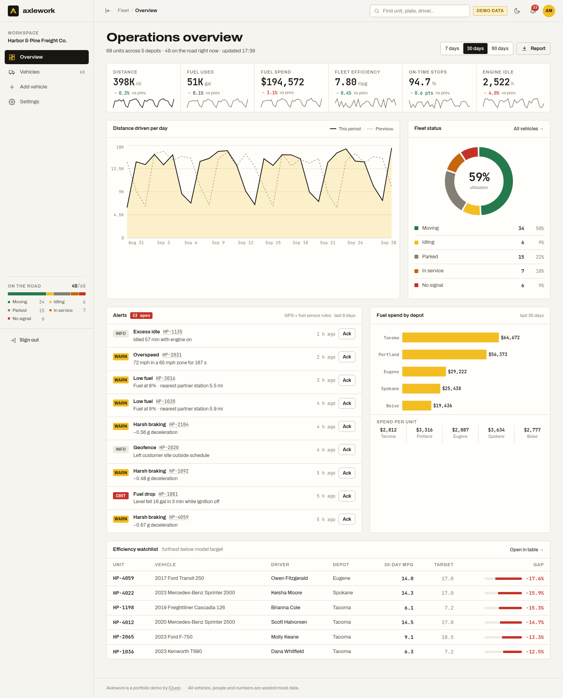
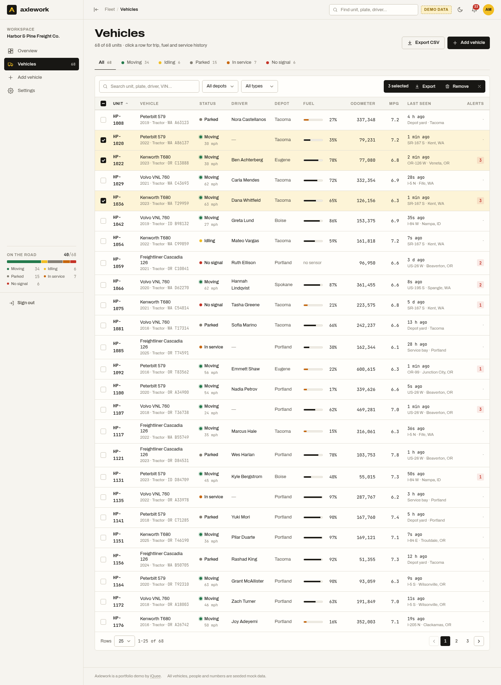
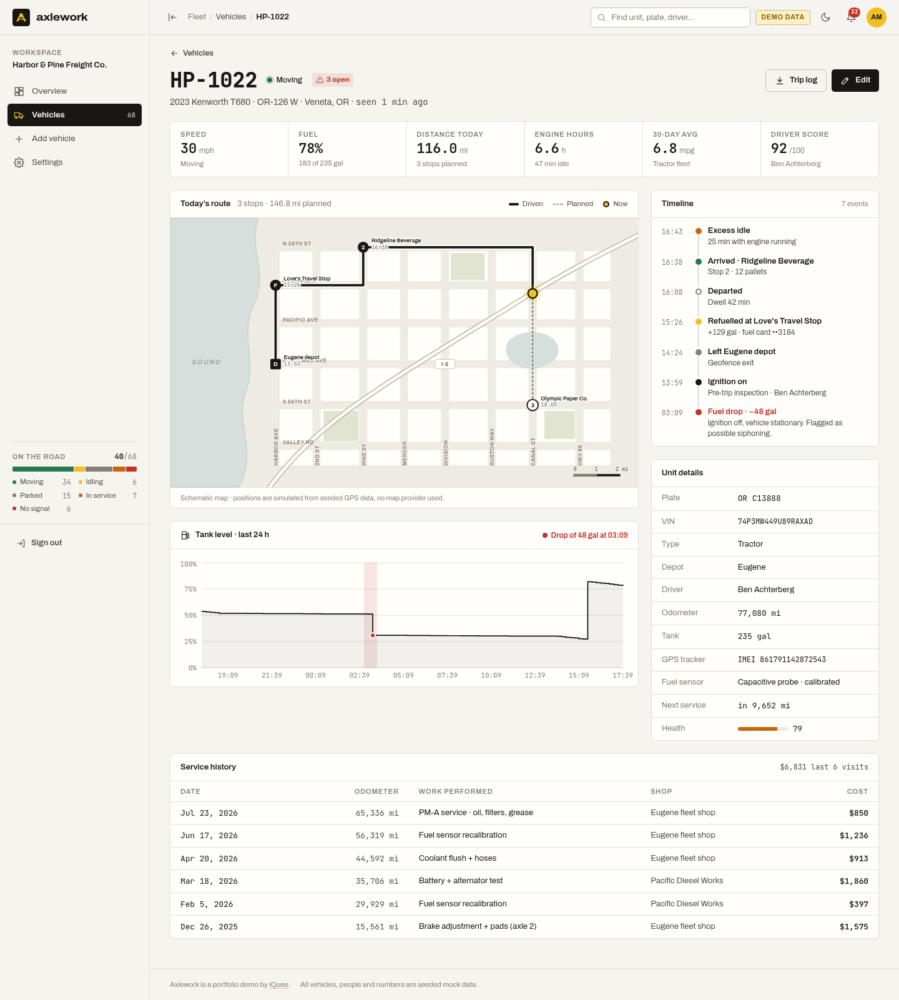
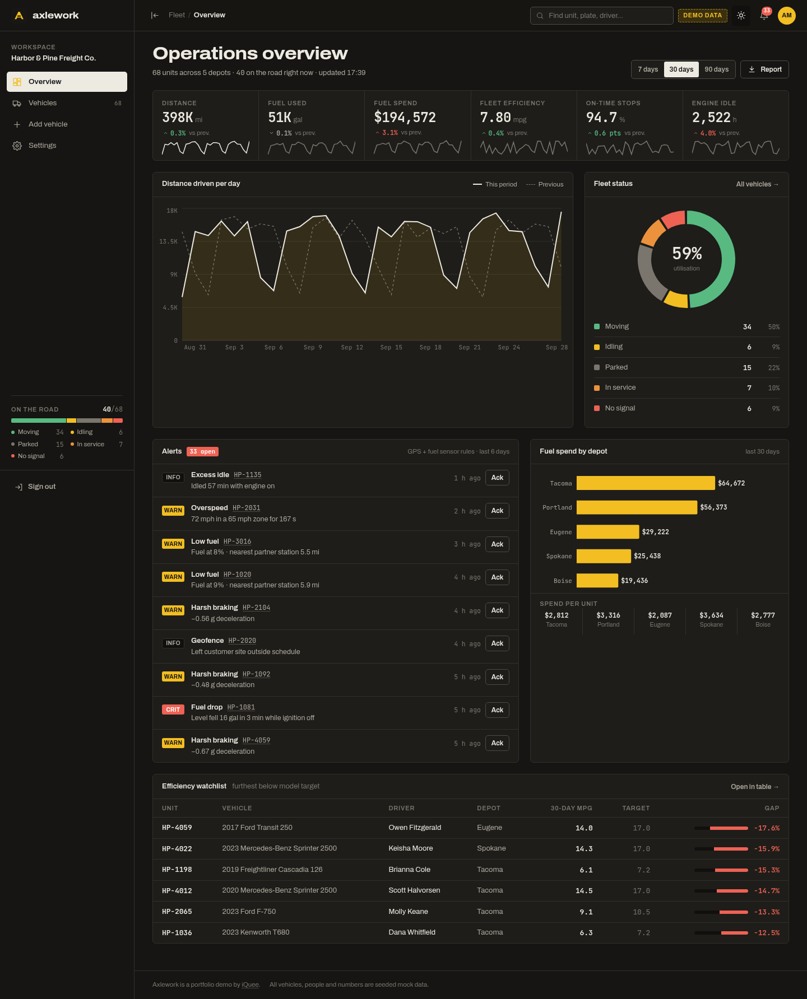

# Axlework — fleet & fuel operations dashboard (demo by iQuee)

A frontend-only admin dashboard for a fictional telematics product, shown here running the workspace of
**Harbor & Pine Freight Co.**, a made-up 68-vehicle carrier in the Pacific Northwest. GPS trackers and tank-level
fuel sensors feed one console: where every unit is, how it is being driven, and where the fuel went.
**Demo only — every vehicle, person and number is seeded mock data. No backend, nothing leaves the browser.**
Live: https://axlework.iquee.tech

## Tech Stack

Versions below match `package.json` (semver ranges as declared).

| Layer | Choice | Version |
| --- | --- | --- |
| **Frontend framework / language** | React + TypeScript | `react` ^18.3.1 · `typescript` ~5.6.2 |
| **Styling** | Tailwind CSS (+ PostCSS, Autoprefixer) | `tailwindcss` ^3.4.19 · `postcss` ^8.5.28 · `autoprefixer` ^10.6.1 |
| **Routing** | React Router | `react-router-dom` ^6.30.6 |
| **Charts** | Recharts | `recharts` ^2.15.4 |
| **Icons / fonts** | Custom inline SVG icons; self-hosted variable fonts (Archivo, JetBrains Mono) | `@fontsource-variable/archivo` ^5.3.0 · `@fontsource-variable/jetbrains-mono` ^5.3.0 |
| **State / data storage** | In-app seeded mock data; edits persist in browser `localStorage` | — (no backend or database) |
| **Build tooling** | Vite + `@vitejs/plugin-react` | `vite` ^5.4.21 · `@vitejs/plugin-react` ^4.7.0 |
| **Linting** | ESLint 9 flat config + typescript-eslint + React Hooks / Refresh plugins | `eslint` ^9.39.5 · `typescript-eslint` ^8.71.0 |
| **Hosting / deploy** | Static `dist/` on Nginx (Ubuntu VPS), Cloudflare in front, Let's Encrypt SSL | — |

There is **no server API and no database**. Fleet, telemetry, and fuel figures are generated in code from a fixed seed; UI edits survive only in the current browser via `localStorage`.

### Production-ready path (future work — not implemented)

A real product would add a REST API with PostgreSQL/TimescaleDB for telemetry, MQTT ingestion from GPS/fuel sensors, and proper authentication. None of that exists in this demo.

## Features

- **Login:** demo sign-in (any email/password) or one-click "Enter demo". Routes are guarded.
- **Overview:** KPI band with period-over-period deltas and sparklines, 7/30/90-day range switch, distance area chart vs previous period,
  fleet-status donut, alert feed with acknowledge, fuel spend by depot (bar), efficiency watchlist, CSV report export.
- **Vehicles:** dense data table with search, status tabs, depot/type filters, sortable columns, pagination (10/25/50),
  row selection with bulk CSV export / remove, export of the filtered set. All table state is URL-synced (shareable links).
- **Vehicle detail:** live stats, schematic SVG route map (driven vs planned path, stops, current position), event timeline,
  24 h tank-level chart with sudden-drop (siphoning) detection, unit spec sheet, service history, trip-log CSV.
- **Add / edit vehicle:** sectioned form with inline + summary validation (unit number format and uniqueness, 17-char VIN rules, 15-digit IMEI, ranges).
- **Settings:** profile, workspace, imperial/metric units (applied app-wide), alert thresholds, notification toggles, theme, reset demo data.
- Light (default) and dark themes, collapsible sidebar, mobile drawer. Data edits persist in `localStorage`.

```bash
npm install
npm run dev       # local dev
npm run build     # -> dist/ (static; serve at the domain root with SPA fallback to index.html)
npx vite preview --port 4174 &
/workspace/.venv-pw/bin/python shots.py   # screenshots -> shot-*.png
```

## Screenshots

| Overview | Vehicles |
| --- | --- |
|  |  |
| **Vehicle detail** | **Dark theme** |
|  |  |
